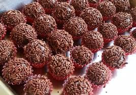

# mid-term-part1
This repo is for practicing mid term exam
<<<<<<< Updated upstream
=======

## Jenifer Quelali & Nathalia Lima

### Jenifer Quelali Evangelista

**Background:** I was born in Brazil, but a side of my family is from Bolivia. I enjoy the culture and food of Brazil, but I decided to pursue my post-secondary education in Canada.

**Hobbies:** Baking, drawing and reading comics.

**Likes:** I like desserts, animals, art and my family.

**Skills:**
1. Creativity
2. Adaptability
3. Empathy
4. Leadership

[My Favourite Website](https://www.canva.com/)

**My Favourite Animations:**
1. Mob Psycho 100
2. Vinland Saga
3. Fumetsu no Anata e

**My Favourite Singers:**
1. Uru
2. Joji
3. Vaundy

### Nathalia Lima

**Hobbies**

I like to bike with my friends at the weekends.

**Favourite movies**

1. Star Wars
2. Inside Out

**Culture**

I'm from Brazil, and my city is Sao Paulo, and there we hug people when meet them, it doesn't matter if it's not a friend.
Another thing, we love to cook for our guests.

**Fav dishes**

1. Lasagna
2. Brigadeiro (Brazilian Sweet)

___

## Installation
No installation required

## Usage
Just enjoy!

## Contributing
1. Fork it!
2. Create your feature branch: `git checkout -b my-new-feature`
3. Commit your changes: `git commit -am 'Add some feature'`
4. Push to the branch: `git push origin my-new-feature`
5. Submit a pull request :D

## History
October, 2023

## Credits
Jenifer Quelali Evangelista

Nathalia Lima

## License
MIT
>>>>>>> Stashed changes
